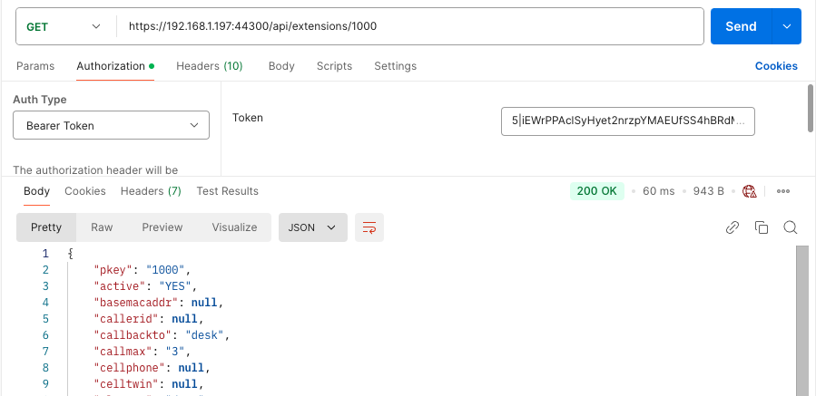

# Authorization

Before you can use the API you must be authorised.  Sark65 API uses Laravel Sanctum, which is token based, a little like Github personal-access-tokens.   Before you can use the API you must have a Bearer Token. You may obtain a token in one of two ways:-

* an administrator may issue you with a traditional UID/PWD.  When you authorize yourself (i.e. login) with the correct credentials then you will be returned a "Bearer Token" which you must supply in the Auth Header for all subsequent calls to the API. 

* an administrator may issue you directly with a Bearer Token.  In these cases there is no requirement to login.   Instead you simply use the Bearer Token when you issue a request to the API.

As an <i>unauthorised</i> user, the ONLY API endpoint you can access is <i>login</i>.   Unless, or until, you succesfully authorize yourself then you will have no other access.  It therefore follows that ALL other requests must be accompanied by a Bearer Token in the Auth Header.

---

## Auth requests

##Login
####POST /auth/login

Body
```
'email' => 'email',
'password' => 'alpha_dash'
```	
Returns 200 OK and a Bearer Token on success

##Logout
####GET /auth/logout
Returns 200 OK on success<br/>
The existing Bearer Token is destroyed

##Register
An authorised user who is also an admin may create a new user with a register request.  The returned details may be passed to the end-user either as a UID/PWD pair or as a bearer token.
####POST /auth/register

Body
```
'name' => 'alpha_dash',
'email' => 'email',
'password' => 'alpha_dash',
'role' => 'NULL|isAdmin',
'endpoint' => 'NULL|integer'

```	
Returns 200 OK and a Bearer Token on success<br/>


##Users
Perform various operations upon the Users relation as follows:-

####GET /auth/users
Returns an index of the users table.

####GET /auth/users/{id}
Returns the user for a given id.

####GET /auth/users/mail/{email}
Returns the user for a given email address.

####GET /auth/users/name/{name}
Returns the user(s) for a given name.

####GET /auth/users/endpoint/{endpoint}
Returns the user(s) for a given SIP endpoint.

####DELETE /auth/users/revoke/{id}
Revokes the token for a given id.

####DELETE /auth/users/{id}
Delete (destroy) a given id.


##Whoami
####GET /auth/whoami
Returns 200 OK and the details for the user making the request 

---

##Examples
####Example:1 Login

After login you must save the <i>"accessToken"</i> for subsequent use.
####Example 2: GET
In this example we will retrieve details for SIP Extension 1000.<br/>

First we must set the query with the accessToken we received from the login (or from an Administrator). We are using Postman for these examples so it's easy enough to set the bearer in Postman's "Authorization" tab.  Then we can run the query to retrieve details for an Extension (in this case Ext1000).


---
<br/><br/>